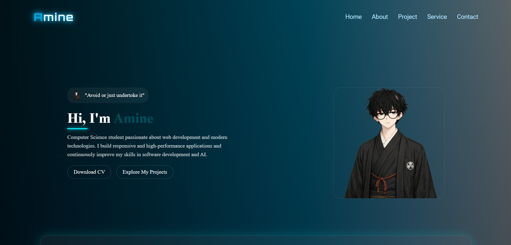

# Amine Portfolio Showcase 💻

Welcome to Amine's Portfolio Showcase!
A modern and elegant personal portfolio website built to present my projects, skills, and professional journey using React.JS.
---

## Live Demo 🚀

You can view the live website here: [Live Demo](https://amineprotoflio.netlify.app/)

---

## 🌟 Website Sections

- **Home**: Developer introduction with avatar and short description  
- **About**: Experience, tech stack, personal insights, and skill cards  
- **Projects**: Showcase of projects with images, descriptions, and skills  
- **Services**: Highlighting services offered with interactive cards  
- **Contact**: Contact form and social links with interactive hover effects  

---

## ⚡ Features

- Clean & modern UI design
- Smooth animations and transitions
- Fully responsive (Desktop / Tablet / Mobile)
- Interactive sections & hover effects
- Clean and organized code structure
- Fast performance & lightweight 

---

## 🛠 Technologies Used

- **React.js** – Building reusable UI components  
- **Vite** – Fast development environment and build tool  
- **JavaScript (ES6+)** – Application logic and functionality  
- **CSS3** – Styling and responsive layout  
- **Font Awesome / Boxicons** – Icons – Scroll animations  

---


## 🚀 How to Use / Customize

 **Clone the repository:**
```bash
git clone https://github.com/Saboo24/portofolio12.git
```
 ---

## 📬 Contact

- Email: asmatalham190@gmail.com   


Made with ❤️ by **elham**


